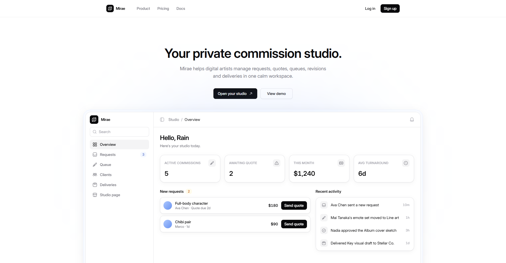
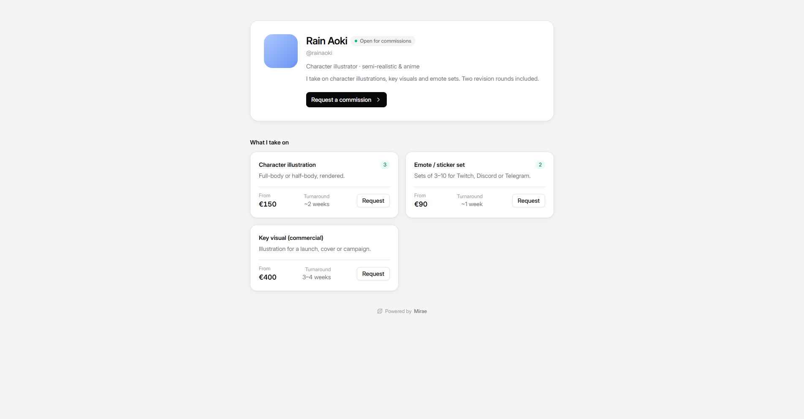
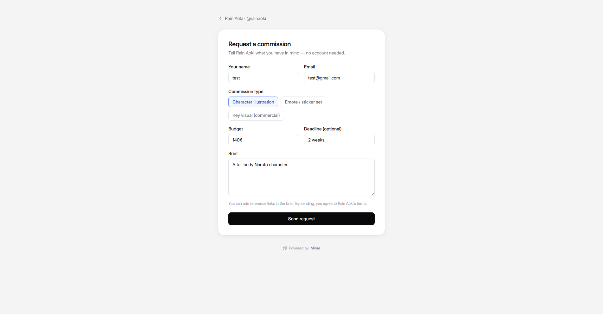
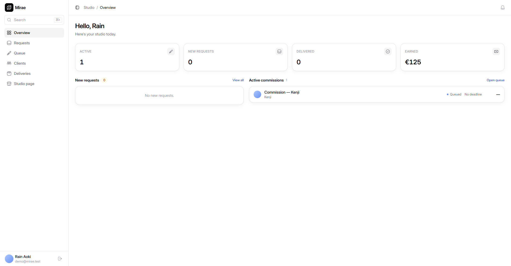
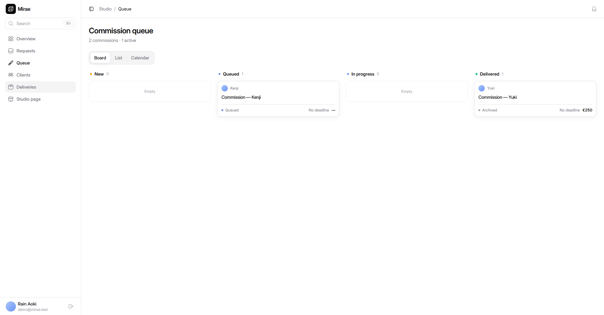
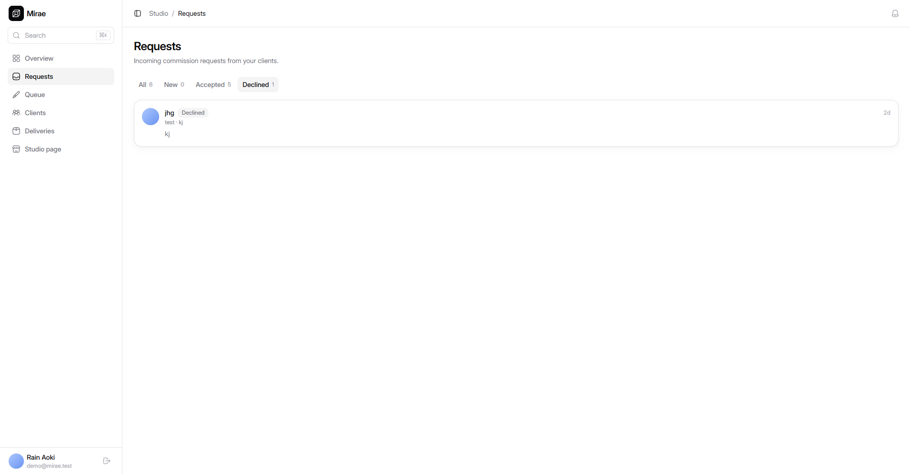
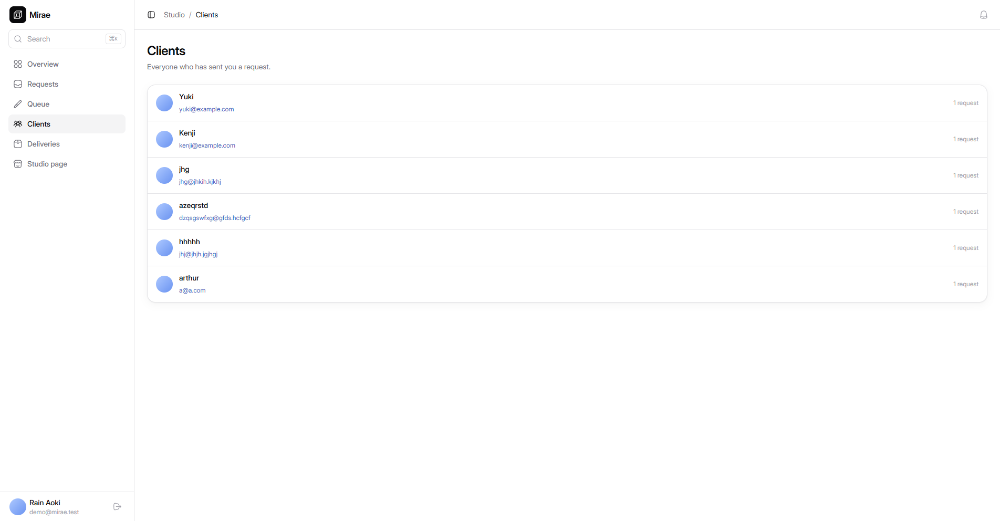
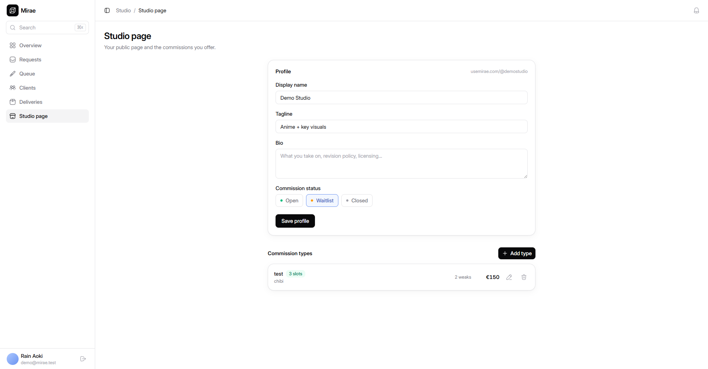

# Mirae

**Your private commission studio.**

> Mirae helps digital artists manage requests, quotes, queues, revisions and deliveries in one calm workspace.

Mirae is the public **and** private studio for digital artists who bring their own audience: a public studio page + structured request intake, then quoting, queue tracking, revisions, and file delivery. Think **Calendly, not VGen** — **Mirae does not discover or match artists and clients. Artists bring their own audience; Mirae turns that audience into structured requests and manages the relationship from intake to delivery.** Not a marketplace, discovery platform, or escrow. Subscription-only — Mirae never takes a cut of commission revenue.

## Status

**MVP complete and deployed** (Sprints 0–9 shipped, plus a Sprint 10 audit/polish pass). Live on Cloudflare:

- **Marketing + public studio:** https://usemirae.com (landing, public `/@handle`, `/portal/:token`, `/delivery/:token`)
- **Dashboard:** https://app.usemirae.com (auth + the private workspace)

Next cycle turns the functional MVP into a differentiated, portfolio-first, mobile-first artist product — see **[`docs/vision/POST_MVP_VISION.md`](docs/vision/POST_MVP_VISION.md)** and **[`docs/roadmap/POST_MVP_ROADMAP.md`](docs/roadmap/POST_MVP_ROADMAP.md)**. Current sprint + next ticket live in [`docs/roadmap/SPRINTS.md`](docs/roadmap/SPRINTS.md).

## Product surfaces

- **Public studio** (`usemirae.com/@handle`) — profile, commission types, open/waitlist/closed state, request form. _Portfolio + link-in-bio + appearance are the next cycle (planned)._
- **Private workspace** (`app.usemirae.com`) — requests inbox, commission queue (board/list/calendar), quotes + manual payment status, deliveries, client management, ⌘K search, notifications.
- **Client portal / delivery** (token-addressed, no account) — status timeline, quote, feedback, downloadable files from R2.

## Screenshots

Current build (light theme; dark tokens dormant).

### Marketing + public

| Landing                                  | Public studio (`/@handle`)                           | Public request form                                         |
| ---------------------------------------- | ---------------------------------------------------- | ----------------------------------------------------------- |
|  |  |  |

### Private workspace

| Overview                                            | Commission queue (board)                               | Requests inbox                              |
| --------------------------------------------------- | ------------------------------------------------------ | ------------------------------------------- |
|  |  |  |

| Clients                                  | Studio-page editor                                        |
| ---------------------------------------- | --------------------------------------------------------- |
|  |  |

## Stack

- **Monorepo:** pnpm workspaces + Turborepo
- **Web:** Vite + React + TanStack Router + Tailwind CSS v4 (`apps/web`)
- **API:** Hono, deployed as a single Cloudflare Worker that also serves the built web app (`apps/api`)
- **Database:** PostgreSQL on Neon (serverless HTTP driver) + Drizzle ORM (`packages/db`)
- **Auth:** Better Auth · **Email:** Resend (transactional notifications) · **Files:** Cloudflare R2
- **Billing:** none yet — subscription billing (Stripe) is **planned post-MVP** (Sprint 25), not implemented. Payment status in-app is currently manual.

Full rationale in [`docs/decisions/DECISIONS.md`](docs/decisions/DECISIONS.md).

## Repository layout

```txt
apps/
  web/        Vite + React app (landing, dashboard, public pages) — builds to dist/
  api/        Hono app — THIS is the deployed Cloudflare Worker
packages/
  db/         Drizzle schema, migrations, seed (Neon)
  shared/     Shared types, zod schemas, constants
  ui/         Mirae design system (Radix behavior + custom visuals)
  config/     Shared tsconfig, ESLint, Prettier
docs/         Source of truth (see below)
```

## Prerequisites

- **Node.js** 24.x (Active LTS) — pinned via `.node-version`
- **pnpm** 11.10.0

## Getting started

```bash
pnpm install
cp .env.example .env   # fill DATABASE_URL + BETTER_AUTH_SECRET (see docs/architecture/CONTRIBUTING.md)
pnpm dev
```

`pnpm dev` runs both processes in parallel (via `turbo run dev`):

| Process        | URL                   | Notes                                |
| -------------- | --------------------- | ------------------------------------ |
| web (vite)     | http://localhost:5173 | proxies `/api/*` to the Worker       |
| api (wrangler) | http://localhost:8787 | health: http://localhost:8787/health |

## Scripts

| Command            | Does                                            |
| ------------------ | ----------------------------------------------- |
| `pnpm dev`         | Run web + api locally                           |
| `pnpm build`       | Build all workspaces                            |
| `pnpm typecheck`   | Type-check all workspaces                       |
| `pnpm lint`        | ESLint across the repo                          |
| `pnpm format`      | Format with Prettier (`format:check` to verify) |
| `pnpm db:generate` | Generate Drizzle migrations                     |
| `pnpm db:migrate`  | Apply migrations to the Neon branch             |
| `pnpm db:studio`   | Open Drizzle Studio                             |

## Deployment

One Worker, one deploy. `run_worker_first` lets Hono see every request: it handles `/api/*`, `/@:handle` OG bot-detection, and host-split routing (dashboard on `app.usemirae.com`, marketing/public on `usemirae.com`); everything else falls through to the static assets binding serving `apps/web/dist`. Custom domains + the R2 `FILES` bucket are declared in `apps/api/wrangler.toml`.

```bash
pnpm build
npx wrangler deploy --config apps/api/wrangler.toml
```

Production secrets (set via `wrangler secret`): `DATABASE_URL`, `BETTER_AUTH_SECRET`, `BETTER_AUTH_URL`, and optionally `RESEND_API_KEY` + `MAIL_FROM` (notification emails no-op without them). The deploy does not run from git — deploy the working tree from `main`.

## Documentation (source of truth)

Current / implemented:

- [`docs/architecture/ARCHITECTURE.md`](docs/architecture/ARCHITECTURE.md) — structure, single-Worker deployment, module rules, endpoints
- [`docs/architecture/DATABASE.md`](docs/architecture/DATABASE.md) — current schema + planned post-MVP schema
- [`docs/product/DESIGN_SYSTEM.md`](docs/product/DESIGN_SYSTEM.md) — visual direction, palette, components, public/mobile principles
- [`docs/decisions/DECISIONS.md`](docs/decisions/DECISIONS.md) — locked stack + product decisions
- [`docs/roadmap/SPRINTS.md`](docs/roadmap/SPRINTS.md) — sprint history + ticket queue
- [`docs/architecture/VERSIONS.md`](docs/architecture/VERSIONS.md) — pinned dependency versions
- [`docs/architecture/CONTRIBUTING.md`](docs/architecture/CONTRIBUTING.md) — local dev, checks, commit/PR rules

Post-MVP direction (planning, not yet built):

- [`docs/vision/POST_MVP_VISION.md`](docs/vision/POST_MVP_VISION.md) — strategic product direction
- [`docs/roadmap/POST_MVP_ROADMAP.md`](docs/roadmap/POST_MVP_ROADMAP.md) — Sprint 10.5 → 25 ticket roadmap
- [`docs/product/PUBLIC_STUDIO_SPEC.md`](docs/product/PUBLIC_STUDIO_SPEC.md) — public studio UX spec
- [`docs/product/MOBILE_PRODUCT_SPEC.md`](docs/product/MOBILE_PRODUCT_SPEC.md) — mobile-first requirements
- [`docs/architecture/DATA_AND_API_EXTENSION.md`](docs/architecture/DATA_AND_API_EXTENSION.md) — planned schema + API additions
